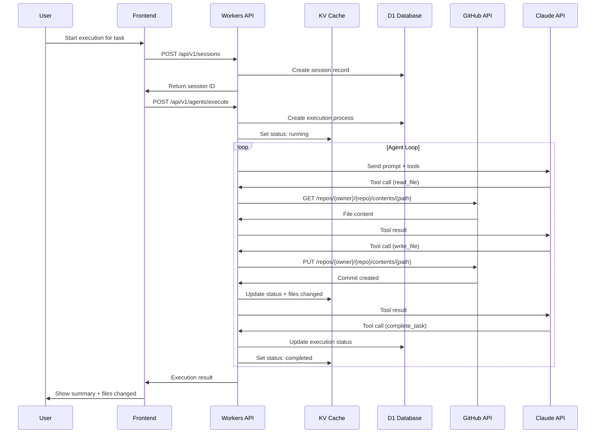
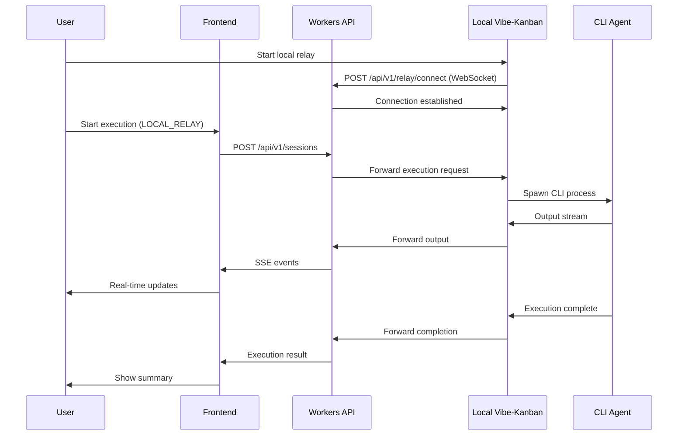

# Hosted Architecture - Execution Flow

## Overview

This document describes the execution flow for running AI coding agents in the hosted Vibe Kanban environment.

## Architecture Diagram

```
┌─────────────────────────────────────────────────────────────────────────────────────┐
│                              Vibe Kanban Hosted Architecture                         │
├─────────────────────────────────────────────────────────────────────────────────────┤
│                                                                                      │
│  ┌──────────────┐     ┌────────────────────────────────────────────────────────┐   │
│  │    User      │     │                   Cloudflare Edge                       │   │
│  │   Browser    │     │  ┌──────────────┐    ┌──────────────────────────────┐  │   │
│  │              │────▶│  │    Pages     │    │          Workers             │  │   │
│  │  React App   │     │  │  (Frontend)  │───▶│                              │  │   │
│  └──────────────┘     │  └──────────────┘    │  ┌────────────────────────┐  │  │   │
│                       │                       │  │      API Router        │  │  │   │
│                       │                       │  │  (Hono + TypeScript)   │  │  │   │
│                       │                       │  └───────────┬────────────┘  │  │   │
│                       │                       │              │               │  │   │
│                       │                       │  ┌───────────▼────────────┐  │  │   │
│                       │                       │  │   Service Layer        │  │  │   │
│                       │                       │  │                        │  │  │   │
│                       │                       │  │ • Auth Service         │  │  │   │
│                       │                       │  │ • Session Service      │  │  │   │
│                       │                       │  │ • Agent Service ◄──────┼──┼───┐ │
│                       │                       │  │ • GitHub Service       │  │   │ │
│                       │                       │  └───────────┬────────────┘  │   │ │
│                       │                       │              │               │   │ │
│                       │                       └──────────────┼───────────────┘   │ │
│                       │                                      │                   │ │
│                       │  ┌───────────────────────────────────┼───────────────┐   │ │
│                       │  │              Storage Layer        │               │   │ │
│                       │  │                                   │               │   │ │
│                       │  │  ┌─────────┐  ┌─────────┐  ┌─────▼─────┐        │   │ │
│                       │  │  │   D1    │  │   KV    │  │    R2     │        │   │ │
│                       │  │  │Database │  │ Cache   │  │  Storage  │        │   │ │
│                       │  │  └─────────┘  └─────────┘  └───────────┘        │   │ │
│                       │  │                                                  │   │ │
│                       │  └──────────────────────────────────────────────────┘   │ │
│                       │                                                          │ │
│                       └──────────────────────────────────────────────────────────┘ │
│                                                                                     │
│  ┌──────────────────────────────────────────────────────────────────────────────┐  │
│  │                           External Services                                   │  │
│  │                                                                               │  │
│  │  ┌────────────────┐  ┌────────────────┐  ┌────────────────┐                  │  │
│  │  │   GitHub API   │  │ Anthropic API  │  │  OpenAI API    │◄─────────────────┘  │
│  │  │                │  │   (Claude)     │  │   (GPT-4)      │                     │
│  │  │ • Repos        │  │                │  │                │                     │
│  │  │ • Branches     │  │ • Tool Use     │  │ • Functions    │                     │
│  │  │ • Files        │  │ • Streaming    │  │ • Streaming    │                     │
│  │  │ • PRs          │  │                │  │                │                     │
│  │  └────────────────┘  └────────────────┘  └────────────────┘                     │
│  │                                                                                  │
│  └──────────────────────────────────────────────────────────────────────────────────┘
│                                                                                      │
└──────────────────────────────────────────────────────────────────────────────────────┘
```

## Execution Flow - Cloud Agent



## Execution Flow - Local Relay

For users who want to use local CLI agents (Claude Code, Cursor, etc.):



## Agent Execution States

```
┌─────────┐     ┌─────────┐     ┌───────────┐     ┌───────────┐
│ PENDING │────▶│ RUNNING │────▶│ COMPLETED │     │ CANCELLED │
└─────────┘     └────┬────┘     └───────────┘     └───────────┘
                     │                                   ▲
                     │          ┌────────┐              │
                     └─────────▶│ FAILED │              │
                     │          └────────┘              │
                     │                                  │
                     └──────────────────────────────────┘
                              (user cancels)
```

## Tool Execution

When an agent calls a tool, the Workers backend executes it:

### Available Tools

| Tool | Description | GitHub API |
|------|-------------|------------|
| `read_file` | Read file contents | `GET /repos/{owner}/{repo}/contents/{path}` |
| `write_file` | Create/update file | `PUT /repos/{owner}/{repo}/contents/{path}` |
| `delete_file` | Delete file | `DELETE /repos/{owner}/{repo}/contents/{path}` |
| `search_code` | Search code | `GET /search/code?q={query}` |
| `list_directory` | List directory | `GET /repos/{owner}/{repo}/contents/{path}` |
| `get_file_diff` | Compare changes | `GET /repos/{owner}/{repo}/compare/{base}...{head}` |
| `run_command` | Execute command | N/A (requires external env) |
| `complete_task` | Mark as done | N/A (internal) |

### Tool Execution Flow

```
┌─────────────────────────────────────────────────────────────┐
│                    Tool Executor                             │
├─────────────────────────────────────────────────────────────┤
│                                                              │
│  ┌──────────────┐                                           │
│  │ Agent calls  │                                           │
│  │ read_file()  │                                           │
│  └──────┬───────┘                                           │
│         │                                                    │
│         ▼                                                    │
│  ┌──────────────────────────────────────────────────────┐   │
│  │                  Tool Router                          │   │
│  │                                                       │   │
│  │  switch(toolName) {                                   │   │
│  │    case 'read_file':                                  │   │
│  │      // Call GitHub API                               │   │
│  │      return await github.getFileContent(path);        │   │
│  │                                                       │   │
│  │    case 'write_file':                                 │   │
│  │      // Create/update via GitHub API                  │   │
│  │      return await github.createOrUpdateFile(...);     │   │
│  │                                                       │   │
│  │    case 'search_code':                                │   │
│  │      // Search via GitHub API                         │   │
│  │      return await github.searchCode(query);           │   │
│  │  }                                                    │   │
│  └──────────────────────────────────────────────────────┘   │
│                                                              │
└──────────────────────────────────────────────────────────────┘
```

## Data Flow

### Session Creation

```json
// POST /api/v1/sessions
{
  "task_id": "uuid",
  "executor": "CLAUDE_API",
  "execution_mode": "cloud"
}

// Response
{
  "id": "session-uuid",
  "branch": "vibe/task-name-abc123",
  "status": "pending"
}
```

### Execution Start

```json
// POST /api/v1/agents/execute
{
  "session_id": "session-uuid",
  "agent_type": "CLAUDE_API",
  "task_description": "Implement user authentication"
}

// Response (after completion)
{
  "id": "execution-uuid",
  "status": "completed",
  "files_changed": ["src/auth.ts", "src/api/login.ts"],
  "tokens_used": 15000,
  "summary": "Implemented JWT-based authentication..."
}
```

### Real-time Updates (SSE)

```javascript
// GET /api/v1/agents/executions/:id/stream
const events = new EventSource('/api/v1/agents/executions/uuid/stream');

events.onmessage = (e) => {
  const data = JSON.parse(e.data);
  // { type: 'tool_call', data: { name: 'write_file', arguments: {...} } }
  // { type: 'file_change', data: { path: 'src/auth.ts', action: 'update' } }
  // { type: 'complete', data: { summary: '...', tokens_used: 15000 } }
};
```

## Error Handling

### Retry Logic

```typescript
const MAX_RETRIES = 3;

async function executeWithRetry(fn: () => Promise<any>): Promise<any> {
  for (let attempt = 0; attempt < MAX_RETRIES; attempt++) {
    try {
      return await fn();
    } catch (error) {
      if (isRetryable(error) && attempt < MAX_RETRIES - 1) {
        await delay(exponentialBackoff(attempt));
        continue;
      }
      throw error;
    }
  }
}
```

### Error Types

| Error | Cause | Action |
|-------|-------|--------|
| Rate Limited | Too many API calls | Exponential backoff |
| Auth Failed | Invalid token | Prompt re-authentication |
| Quota Exceeded | Usage limit hit | Notify user |
| Tool Failed | GitHub API error | Retry or fail gracefully |
| Agent Error | LLM returned error | Log and notify |

## Security

### Token Management

```
┌─────────────────────────────────────────────────────────────┐
│                    Token Flow                                │
├─────────────────────────────────────────────────────────────┤
│                                                              │
│  1. User connects GitHub                                     │
│     └─▶ OAuth flow ─▶ Access token received                 │
│                                                              │
│  2. Token stored (encrypted)                                 │
│     └─▶ D1: github_connections.access_token_encrypted       │
│                                                              │
│  3. Agent execution                                          │
│     └─▶ Retrieve token ─▶ Decrypt ─▶ Use for GitHub API     │
│                                                              │
│  4. Token refresh (if expires)                               │
│     └─▶ Refresh token ─▶ Update stored token                │
│                                                              │
└─────────────────────────────────────────────────────────────┘
```

### Permission Model

| Operation | Required Role |
|-----------|---------------|
| View sessions | viewer, member, admin, owner |
| Create sessions | member, admin, owner |
| Start execution | member, admin, owner |
| Stop execution | member (own), admin, owner |
| Delete sessions | admin, owner |
