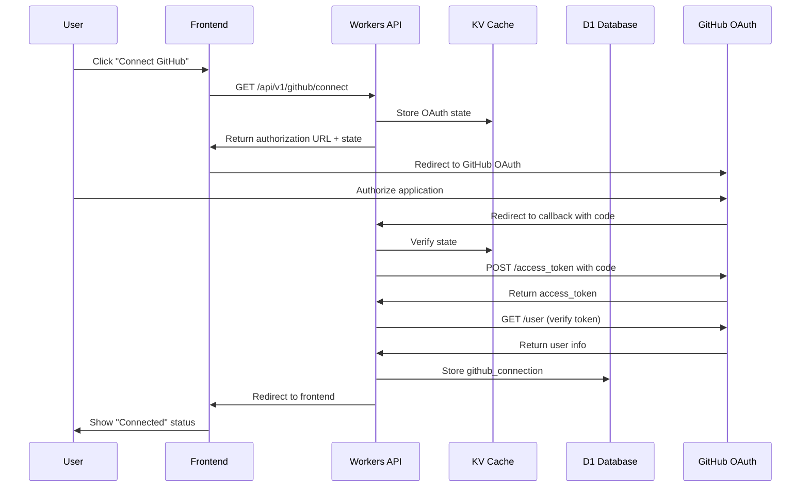

# GitHub Integration Architecture

## Overview

Vibe Kanban integrates with GitHub to enable cloud-based code operations. This document describes the OAuth flow, repository management, and git operations through the GitHub API.

## Integration Architecture

```
┌─────────────────────────────────────────────────────────────────────────────────┐
│                         GitHub Integration Architecture                          │
├─────────────────────────────────────────────────────────────────────────────────┤
│                                                                                  │
│  ┌──────────────────────┐                                                       │
│  │        User          │                                                       │
│  │                      │                                                       │
│  │  • GitHub Account    │                                                       │
│  │  • Repositories      │                                                       │
│  │  • Access Tokens     │                                                       │
│  └──────────┬───────────┘                                                       │
│             │                                                                    │
│             │ OAuth 2.0                                                          │
│             │                                                                    │
│  ┌──────────▼───────────────────────────────────────────────────────────────┐   │
│  │                         Vibe Kanban Platform                              │   │
│  │                                                                           │   │
│  │  ┌───────────────┐    ┌────────────────┐    ┌────────────────────────┐   │   │
│  │  │   Frontend    │    │   Workers API  │    │    GitHub Service      │   │   │
│  │  │               │    │                │    │                        │   │   │
│  │  │ • OAuth Init  │───▶│ • Callback     │───▶│ • Token Management     │   │   │
│  │  │ • Repo List   │    │ • Token Store  │    │ • API Requests         │   │   │
│  │  │ • Branch UI   │    │ • Repo CRUD    │    │ • Rate Limiting        │   │   │
│  │  └───────────────┘    └────────────────┘    └────────────────────────┘   │   │
│  │                                                                           │   │
│  └───────────────────────────────────────────────────────────────────────────┘   │
│                                                                                  │
│  ┌──────────────────────────────────────────────────────────────────────────┐   │
│  │                              GitHub Platform                              │   │
│  │                                                                           │   │
│  │  ┌─────────────────┐  ┌─────────────────┐  ┌─────────────────────────┐   │   │
│  │  │   OAuth Server  │  │   REST API      │  │   Webhooks (Future)     │   │   │
│  │  │                 │  │                 │  │                         │   │   │
│  │  │ /login/oauth    │  │ /repos          │  │ • Push events           │   │   │
│  │  │ /access_token   │  │ /contents       │  │ • PR events             │   │   │
│  │  │                 │  │ /pulls          │  │ • CI status             │   │   │
│  │  └─────────────────┘  └─────────────────┘  └─────────────────────────┘   │   │
│  │                                                                           │   │
│  └──────────────────────────────────────────────────────────────────────────┘   │
│                                                                                  │
└──────────────────────────────────────────────────────────────────────────────────┘
```

## OAuth Flow

### Sequence Diagram



### OAuth Configuration

**GitHub OAuth App Settings:**
- Application name: `Vibe Kanban`
- Homepage URL: `https://vibe-kanban.pages.dev`
- Callback URL: `https://vibe-kanban-api-production.*.workers.dev/api/v1/github/callback`

**Scopes Requested:**
| Scope | Purpose |
|-------|---------|
| `repo` | Full repository access (read/write) |
| `read:user` | Read user profile |
| `user:email` | Access user email |

### Data Model

```sql
-- GitHub connection per user
CREATE TABLE github_connections (
  id TEXT PRIMARY KEY,
  user_id TEXT NOT NULL REFERENCES users(id),
  github_user_id TEXT NOT NULL,
  github_username TEXT NOT NULL,
  access_token_encrypted TEXT NOT NULL,  -- TODO: Implement encryption
  refresh_token_encrypted TEXT,
  scopes TEXT NOT NULL,
  expires_at TEXT,
  created_at TEXT DEFAULT CURRENT_TIMESTAMP,
  updated_at TEXT DEFAULT CURRENT_TIMESTAMP
);

-- Connected repositories per workspace
CREATE TABLE connected_repositories (
  id TEXT PRIMARY KEY,
  workspace_id TEXT NOT NULL REFERENCES workspace_teams(id),
  github_connection_id TEXT REFERENCES github_connections(id),
  repo_owner TEXT NOT NULL,
  repo_name TEXT NOT NULL,
  default_branch TEXT NOT NULL DEFAULT 'main',
  created_at TEXT DEFAULT CURRENT_TIMESTAMP,
  updated_at TEXT DEFAULT CURRENT_TIMESTAMP
);
```

## Repository Operations

### Connect Repository Flow

```
┌─────────────────────────────────────────────────────────────────┐
│                   Repository Connection Flow                     │
├─────────────────────────────────────────────────────────────────┤
│                                                                  │
│  1. User selects repository                                      │
│     └─▶ GET /api/v1/github/repos (lists user's repos)           │
│                                                                  │
│  2. Connect to workspace                                         │
│     └─▶ POST /api/v1/github/repos/connect                       │
│         {                                                        │
│           "workspace_id": "uuid",                                │
│           "repo_owner": "owner",                                 │
│           "repo_name": "repo"                                    │
│         }                                                        │
│                                                                  │
│  3. Verify access                                                │
│     └─▶ GET /repos/{owner}/{repo} (via GitHub API)              │
│                                                                  │
│  4. Store connection                                             │
│     └─▶ INSERT INTO connected_repositories                      │
│                                                                  │
└─────────────────────────────────────────────────────────────────┘
```

### Branch Operations

#### Create Branch for Task

```typescript
// POST /api/v1/github/branches
{
  "session_id": "uuid",
  "repo_owner": "owner",
  "repo_name": "repo",
  "branch_name": "vibe/feature-abc123",
  "base_branch": "main"  // optional, defaults to repo default
}

// Implementation:
// 1. GET /repos/{owner}/{repo}/git/refs/heads/{base_branch}
//    → Get SHA of base branch
// 2. POST /repos/{owner}/{repo}/git/refs
//    → Create new ref pointing to same SHA
```

#### Branch Naming Convention

```
vibe/{task-slug}-{short-id}

Examples:
- vibe/implement-auth-a1b2c3d4
- vibe/fix-login-bug-e5f6g7h8
- vibe/add-dark-mode-i9j0k1l2
```

### File Operations

All file operations go through the GitHub Contents API:

```
┌─────────────────────────────────────────────────────────────────┐
│                      File Operations                             │
├─────────────────────────────────────────────────────────────────┤
│                                                                  │
│  READ FILE                                                       │
│  GET /repos/{owner}/{repo}/contents/{path}?ref={branch}         │
│  Response: { content: base64, sha: "...", ... }                 │
│                                                                  │
│  CREATE FILE                                                     │
│  PUT /repos/{owner}/{repo}/contents/{path}                      │
│  Body: {                                                         │
│    message: "Create file",                                       │
│    content: base64(content),                                     │
│    branch: "vibe/feature-abc"                                    │
│  }                                                               │
│                                                                  │
│  UPDATE FILE                                                     │
│  PUT /repos/{owner}/{repo}/contents/{path}                      │
│  Body: {                                                         │
│    message: "Update file",                                       │
│    content: base64(content),                                     │
│    sha: "current-sha",  // Required for updates                  │
│    branch: "vibe/feature-abc"                                    │
│  }                                                               │
│                                                                  │
│  DELETE FILE                                                     │
│  DELETE /repos/{owner}/{repo}/contents/{path}                   │
│  Body: {                                                         │
│    message: "Delete file",                                       │
│    sha: "current-sha",                                           │
│    branch: "vibe/feature-abc"                                    │
│  }                                                               │
│                                                                  │
└─────────────────────────────────────────────────────────────────┘
```

### Pull Request Operations

#### Create PR After Agent Completes

```typescript
// POST /api/v1/github/pull-requests
{
  "session_id": "uuid",
  "repo_owner": "owner",
  "repo_name": "repo",
  "title": "Implement user authentication",
  "body": "## Changes\n- Added JWT auth\n- Created login endpoint\n\n## Testing\n- All tests pass\n\n_Created by Vibe Kanban_",
  "head": "vibe/feature-abc123",
  "base": "main",
  "draft": false
}

// Response
{
  "number": 42,
  "html_url": "https://github.com/owner/repo/pull/42",
  "state": "open"
}
```

## Rate Limiting

### GitHub API Rate Limits

| Auth Type | Limit |
|-----------|-------|
| Authenticated | 5,000 req/hour |
| Search API | 30 req/min |

### Handling Rate Limits

```typescript
async function githubRequest(url: string, options: RequestInit) {
  const response = await fetch(url, options);
  
  // Check rate limit headers
  const remaining = response.headers.get('X-RateLimit-Remaining');
  const resetTime = response.headers.get('X-RateLimit-Reset');
  
  if (response.status === 403 && remaining === '0') {
    const waitTime = parseInt(resetTime!) * 1000 - Date.now();
    throw new RateLimitError(`Rate limited. Reset in ${waitTime}ms`);
  }
  
  return response;
}
```

## Security Considerations

### Token Storage

**Current Implementation:**
- Tokens stored in D1 (plain text - TODO: encrypt)

**Recommended Implementation:**
```typescript
// Encrypt token before storage
async function encryptToken(token: string, key: CryptoKey): Promise<string> {
  const iv = crypto.getRandomValues(new Uint8Array(12));
  const encrypted = await crypto.subtle.encrypt(
    { name: 'AES-GCM', iv },
    key,
    new TextEncoder().encode(token)
  );
  return btoa(String.fromCharCode(...iv, ...new Uint8Array(encrypted)));
}

// Decrypt when needed
async function decryptToken(encrypted: string, key: CryptoKey): Promise<string> {
  const data = Uint8Array.from(atob(encrypted), c => c.charCodeAt(0));
  const iv = data.slice(0, 12);
  const ciphertext = data.slice(12);
  const decrypted = await crypto.subtle.decrypt(
    { name: 'AES-GCM', iv },
    key,
    ciphertext
  );
  return new TextDecoder().decode(decrypted);
}
```

### Scope Minimization

Only request necessary scopes:
- For read-only: `public_repo` instead of `repo`
- For user info: `read:user` only

### Token Rotation

- Monitor token usage
- Refresh tokens before expiration
- Revoke on user disconnect

## API Endpoints Summary

| Endpoint | Method | Description |
|----------|--------|-------------|
| `/github/status` | GET | Check connection status |
| `/github/connect` | GET | Start OAuth flow |
| `/github/callback` | GET | OAuth callback |
| `/github/disconnect` | DELETE | Remove connection |
| `/github/repos` | GET | List user repositories |
| `/github/repos/connect` | POST | Connect repo to workspace |
| `/github/repos/connected` | GET | List connected repos |
| `/github/repos/:id` | DELETE | Disconnect repository |
| `/github/branches` | POST | Create branch |
| `/github/branches/:owner/:repo/:branch` | GET | Get branch info |
| `/github/pull-requests` | POST | Create PR |
| `/github/pull-requests/:owner/:repo/:number` | GET | Get PR info |

## Error Handling

| Error Code | Meaning | Action |
|------------|---------|--------|
| 401 | Token invalid/expired | Prompt reconnection |
| 403 | Rate limited | Wait and retry |
| 404 | Repo/file not found | Check path |
| 409 | Conflict (e.g., file changed) | Refetch and retry |
| 422 | Validation error | Check request body |
